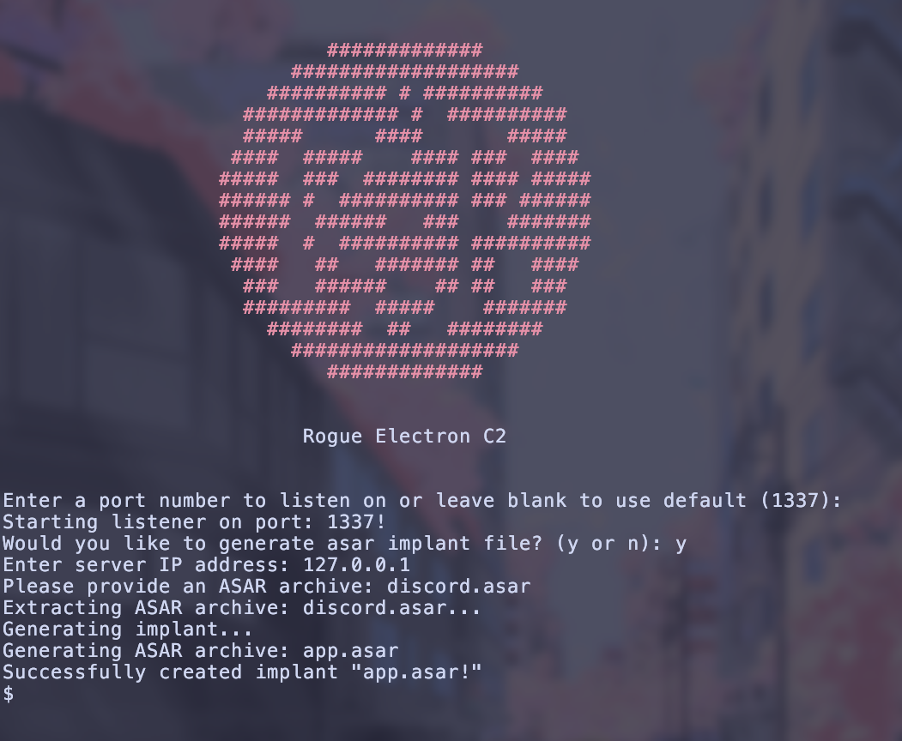

# Rogue Electron 😈
A C2 server designed to run within Electron applications.
## Disclaimer!!!!
**This project is for demonstration/educational purposes only! Do not install a C2 on any system you do not have explicit permission to do so on. Be smart, do not break the law. I am not responsible for any malicious/illegal activity that may be conducted with this program.**

## Usage
### Getting Started
To run the server you'll need python (version 3) and openssl installed, all other dependencies will be installed by the setup script.

1. Most Electron apps store their ASAR archive in `%LOCALAPPDATA%\[application name]\[version]\resources\app.asar`, make a copy of this and keep somewhere safe.

2. Run the setup script with the command `sudo chmod +x ./setup.sh && ./setup.sh`

3. Run the server script with `sudo python server.py`. **Note!!** *the server must be run as sudo*

*If you run into issues you may need to specify python version 3, eg. `sudo python3 server.py`*

4. You'll be prompted if you want to create an ASAR archive, enter `y`.
5. Next provide the server's IP address.
6. Now provide to the ASAR file you ~~stole~~ copied and it will do all the work for you. The archive created will be called `app.asar`.

7. All you need to do now is replace the *legitimate* ASAR file of your target application. eg. if you want to backdoor Discord, overwrite the current ASAR archive in `%LOCALAPPDATA%\Discord\app-[versionnumber]\resources\`.
8. Launch the application and you'll have a C2 connection.

### Commanding and Controlling
Right now, the C2 is very simple. You can run any command that is supported by the OS the application is installed on (*most likely Windows*). There are a few extra commands:

- `getpid` will display the process ID of the implant.
- `kill` will kill the entire Electron application that the implant is running within (**yes this is the desired functionality**).
- `clear` clears the screen.
- `history` will show your previous commands.
- `banner`  will display the really cool nice looking logo.
- `help` will tell you what I'm telling you right now.
- `exit` will exit the program ***note:** this will not kill the client, which will still be trying to ping the server!*

## Backstory
### The Electron Problem
#### ASAR Archives
Rogue Electron C2 exploits a flaw in Electron ASAR archives. ASAR archives contain the entire source for an Electron application, they are largely made up of JavaScript files, with a file `package.json` pointing to the "main" script which will be executed when the Electron application's executable is launched. ASAR files can be easily modified to include arbitrary JavaScript, which will be executed as the application process. As of Electron version 30.0.0, ASAR integrity checking has been introduced, however it is considered an "experimental feature" and is not enabled by default (source: [literally electron themselves](https://www.electronjs.org/docs/latest/tutorial/asar-integrity)). 
#### Crappy Applications First, Security... Last
Even if developers wanted to implement ASAR integrity checking, a lot of them can't. The latest version of Discord, 1.0.9163 (as of 17/09/2024), uses Electron 28.2.10 notably 2 major versions behind the required version 30.0.0 for ASAR integrity checking. Even the Electron-based Microsoft Teams (Classic) (*not the new one*), at its most up-to-date version (*before Microsoft Teams (New) (with Copilot) (Office 365) (For work and school) (~~Bedrock edition with RTX raytracing~~) completely replaced it*) used Electron 22.3.27.

Because of this oversight, Electron applications will not complain if you completely replace their entire source code, and *in the case of Microsoft Teams (**Not New**)™, run code as a *~~perfectly safe~~* Microsoft signed and approved executable. This is where the idea for a stealthy C2 came about.
### Exploiting Integrity Checking (or lack thereof...)
So you can change any code within essentially any Electron application, great (*if you're an attacker, not so great for users*). To exploit this, I created a JavaScript C2 client which reaches out to a server (written in Python using [FastAPI](https://fastapi.tiangolo.com/) and [Uvicorn](https://www.uvicorn.org/)) and executes commands using node (*which is not necessarily available in all Electron applications, but I've tested it in Discord and Teams (Classic) and it works so...*). I then chucked this script into an ASAR archive and replaced the ASAR file of an Electron application with my new malicious ASAR archive. Because most Electron applications do not have integrity checking, the application will run just fine and execute my JavaScript C2 client.

## Features
### Current
- Execute commands remotely through an Electron app (with Node JS integration enabled).
- Inject C2 into legitimate ASAR archive.
- TLS encryption.
- Request randomisation.
- File upload and download.
### Planned
- [x] Modify existing ASAR file, injecting C2 client into it (eg. supply MS Teams ASAR archive and receive back modified archive with embedded C2).
- [x] File upload/download.
- [x] Client killing
- [ ] Persistance between updates (currently, when an app updates it will *usually* download a new ASAR archive replacing the backdoored one).
- [ ] Multiple sessions/session handling.

## Compatibility

This exploit doesn't work on all Electron applications, as I mentioned earlier this can be mitigated through ASAR integrity checking. There may also be applications where ASAR Integrity checking is disabled, but Node integration is not used therefore the C2 is unable to execute commands. I have only tested this on Windows, but theoretically it should work on any OS as long as the Electron application has the necessary security vulnerabilities.

This is a list of applications I've tested ASAR modification on (ones with ticks fully work with Rogue Electron, those without have not been tested).

- [x] Discord
- [x] Microsoft Teams (Classic)
- [x] VS Code*
- [ ] Obsidian

*VS Code does not actually use an ASAR archive, instead it has what is essentially an decompressed archive located in `%LocalAppData%\Programs\Microsoft VS Code\resources\app`. By modifying the main script under `.\out\main.js` to include implant code the same effect can be achieved.

The following list is Electron applications that seemingly have ASAR integrity checking enabled (or at least I was unable to modify the ASAR archive):

- [x] Signal
- [x] Slack

## Detection
### Anti-Virus
Because Rogue Electron runs within trusted applications, it is unlikely to be detected by signature-based AV detections. I've been testing this on Windows 11 with Windows Defender fully enabled (real-time and cloud delivered protection both enabled) and it detected nothing, largely because it doesn't look that suspicious from an AV perspective. Online scanners like VirusTotal can't give an accurate detection from the ASAR file because it can't actually execute it without the executable and other dependencies.

### Network Traffic
Rogue Electron's network traffic looks like a lot of other C2s. I recommend looking for large amounts of traffic to an unusual IP, if you can attribute the traffic to a process then look for unusual connections for a particular process (eg. Discord contacting a non-Discord IP). Also look for traffic using suspicious TLS certificates (self-signed, not provided by reputable organisation). Decrypting the traffic might not be much help as the request paths are quite generic, although this would assist in detecting file download/upload.

### Execution
Looking at Windows Security Logs, you'll see `EVID 4688 (Process Creation)` for `cmd.exe` with a parent process of whichever Electron application has been infected. Depending on the application, it may be typical for it to spawn cmd, but it may be worthwhile creating detections for any Electron programs spawning cmd within your environment (*just monitor for any false positives and adjust accordingly*).

### ASAR Archive Modification
Until ASAR integrity checking is widely implemented (and utilised by developers), the simplest way to detect Rogue Electron is to configure a system access control list (SACL) to audit file modification on all Electron AppData directories, and make a detection rule for modifcations to the ASAR archive. You'll most likely need to filter out the application itself and it's updater (most Electron applications have a seperate "updater" executable) to avoid false positives.

## Acknowlegements
Credit to L>>K (Andrew Kisliakov) for his [article discussing ASAR modification in Electron apps.](https://l--k.uk/2022/01/16/microsoft-teams-and-other-electron-apps-as-lolbins/)

And special thanks to [Aurillium](https://github.com/Aurillium) for translating my cursed C++ spaghetti code into Python so that I could actually read my own code.

Some further reading I'd recommend is the [MITRE ATT&CK page](https://attack.mitre.org/techniques/T1218/015/) entirely dedicated to Electron applications, in which one of their recommended mitigations is to simply remove Electron applications from your environment (can't say I disagree with that one). It also discusses other ways to exploit Electron applications.